# Configuración de un servidor FTP

<p align="left">

</p>

## Índice

1. [Paquetes necesarios](#paquetes-necesarios)
2. [Creación de usuarios y contraseñas para el acceso web](#creacion-de-usuarios-y-contraseñas-para-el-acceso-web)
3. [Configurando el servidor Nginx para usar autenticación básica](#configurando-el-servidor-nginx-para-usar-autenticacion-básica)
4. [Probando la nueva configuración](#probando-la-nueva-configuración)
5. [Tareas](#tareas)
6. [T.1](#t1)
7. [T.2](#t2)
8. [Combinación de autenticación básica y restricción por IP](#combinación-de-la-autenticación-básica-con-la-restricción-de-acceso-por-ip)
9. [Tarea 1](#tarea-1)
10. [Tarea 2](#tarea-2)

---

## Paquetes necesarios

Instalamos los paquetes necesarios con el comando

```
dpkg -l | grep openssl
```

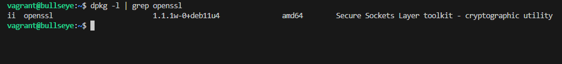

Si no lo tuvieramos instalado, lo instalamos con el comando

```
sudo apt install openssl -y
```

## Creacion de usuarios y contraseñas para el acceso web

Crearemos un archivo oculto llamado .htpasswd en el directorio de configuración /etc/nginx donde
guardar nuestros dos usuarios y contraseñas en mi caso:

```
sudo sh -c "echo -n 'nicolas:' >> /etc/nginx/.htpasswd"
sudo sh -c "echo -n 'cervera:' >> /etc/nginx/.htpasswd"
```

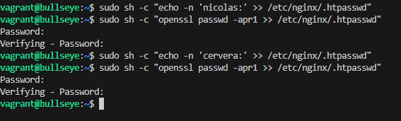

Ahora crearemos un pasword cifrado para el usuario de forma interactiva que es el utilizado por mi caso:

```
sudo sh -c "openssl passwd -apr1 >> /etc/nginx/.htpasswd"
```

o de forma no interactiva:

```
sudo sh -c "openssl passwd -apr1 'aqui_iria_la_contraseña'>> /etc/nginx/.htpasswd"
```

Para comprobar que el usuario y la contraseña aparecen cifrados en el fichero:

```
cat /etc/nginx/.htpasswd
```

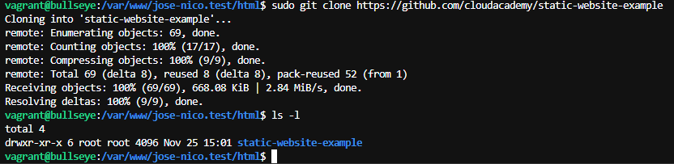

## Configurando el servidor Nginx para usar autenticacion básica

Accederemos al archivo de nuestra configuración de nginx con el comando:

```
sudo nano /etc/nginx/sites-available/jose-nico.test
```

donde realizaremos la configuración de autenticación básica.

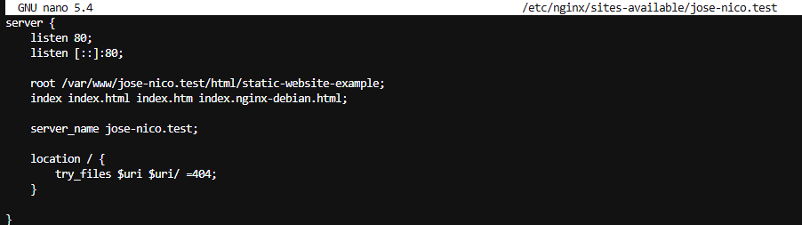

Ahora reiniciaremos el servidor nginx con el comando:

```
sudo systemctl restart nginx
```

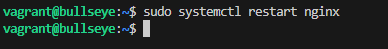

## Probando la nueva configuración

Y la comprobacion de la autenticación básica nos iriamos a la url http://jose-nico.test y se pediria la autenticacion:

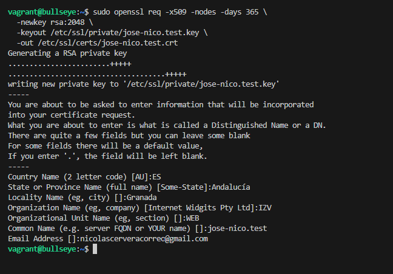

Donde introducimos el usuario y la contraseña.

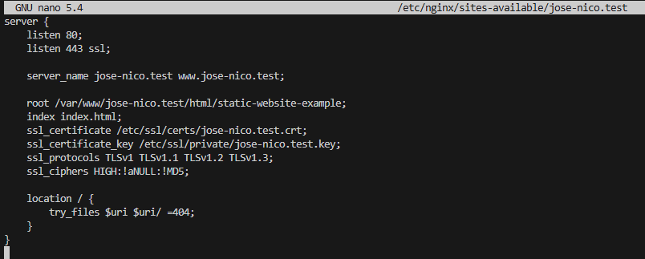

Donde al introducir el usuario y la contraseña correctamente se mostraria la pagina web.

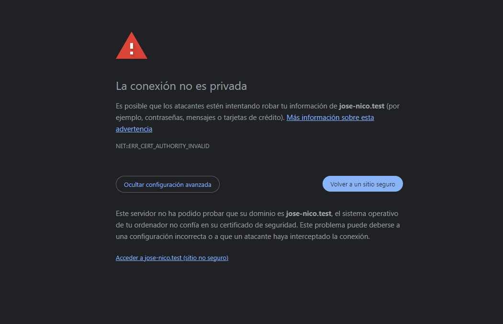

Y lo mismo para el usuario cervera.

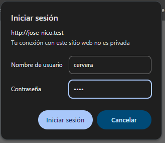

Donde al introducir el usuario y la contraseña correctamente se mostraria la pagina web.


Si decimos cancelar el inicio de sesion nos saldria la pagina web de error 401 Authorization Required.

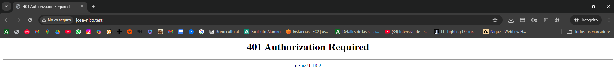

Y cuando lo comprobamos en el archivo access.log nos saldria el siguiente mensaje:

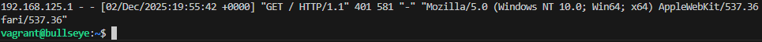

## Tareas

### T.1

Sin embargo si introducimos mal el usuario o la contraseña saldria el siguiente mensaje en el archivo access.log:


Cuando introducimos correctamente el usuario y la contraseña saldria el siguiente mensaje en el archivo access.log en este caso el usuario cervera:

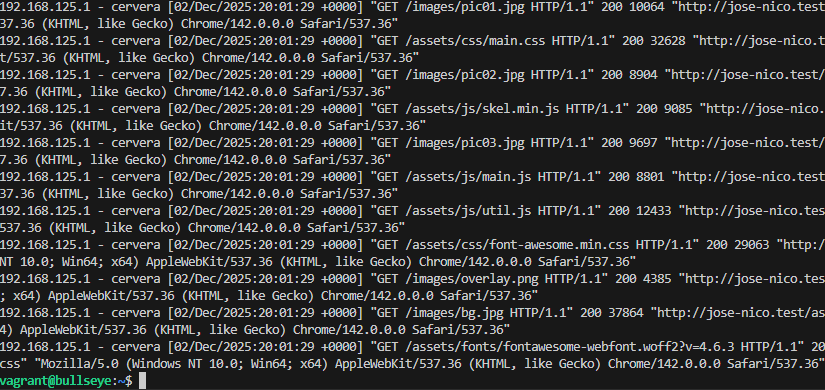

### T.2


Configuraremos ahora la restriccion de acceso en /contact.html añadiendole la autenticacion básica a un nuevo location.
Borraremos las dos líneas que hacen referencia a la autenticación básica en el location del directorio raíz.

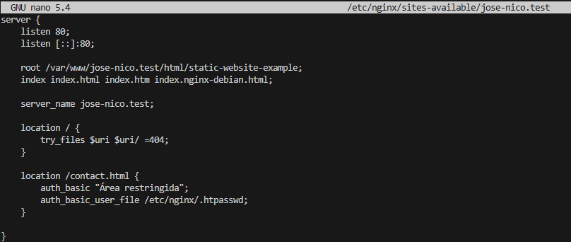

Tras cambiar el archivo de configuracion de nginx para que ahora la restriccion de acceso se haga en /contact.html

Por lo tanto se comprobaria la autenticacion basic en la url http://jose-nico.test/contact.html

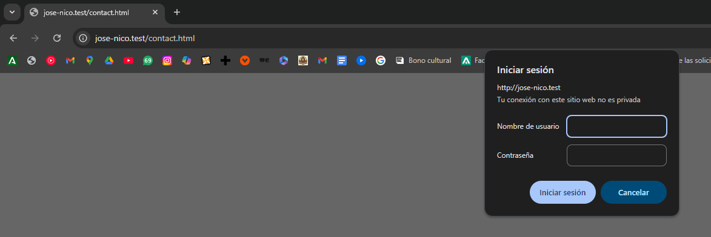

Ahora entrariamos con el usuario nicolas y la contraseña para este usuario.

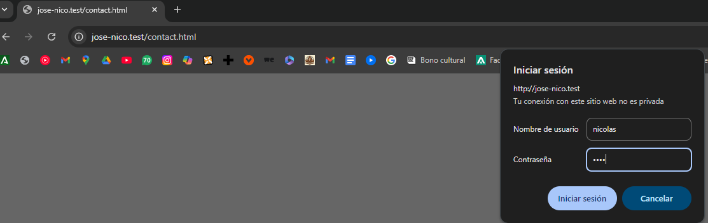

Comprobacion de la autenticacion basic en la ruta /contact.html en el archivo access.log:

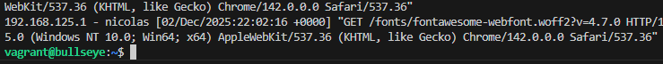

Y posterior a esto se mostraria la pagina web.

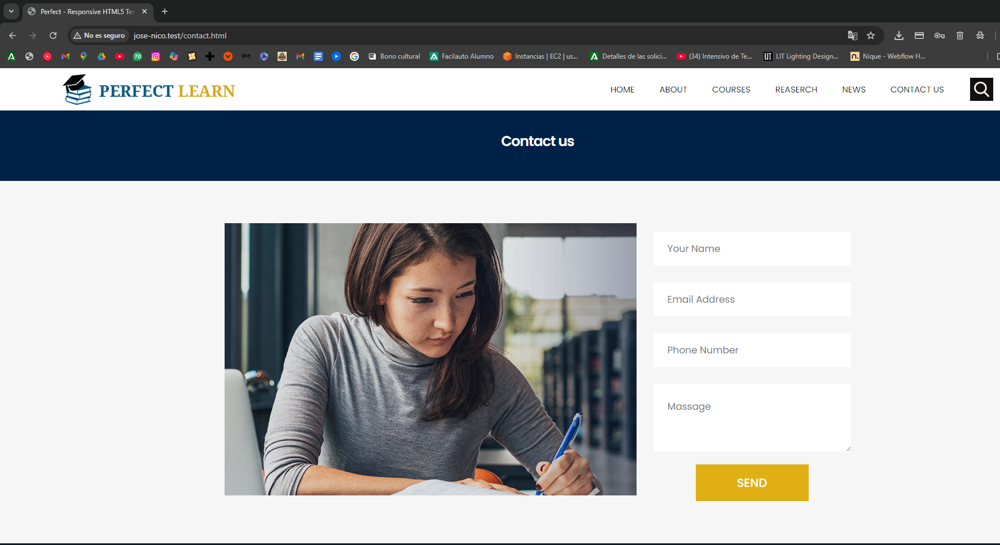


## Combinación de autenticación básica y restricción por IP

### Tarea 1

Ahora pasaremos a restringir el acceso por ip.

Donde bloquearemos el acceso a la ip 192.168.125.1 que es la ip de mi maquina virtual para que no pueda acceder a la pagina web desde la raiz.

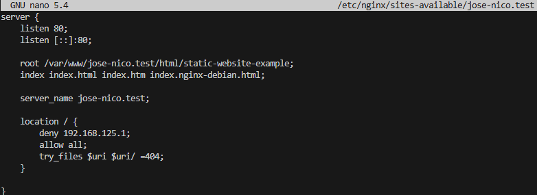

Ejecutaremos el comando:

```
sudo systemctl restart nginx
```

Y así se reiniciaria el servidor nginx para que se aplicara la nueva configuracion.

Y ahora al intentar acceder a la pagina web desde la ip 192.168.125.1 nos saldria la pagina web de error 403 Forbidden.

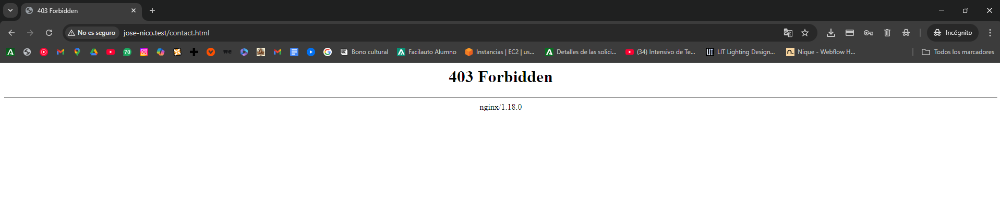

Donde en el archivo error.log nos saldria el siguiente mensaje:


### Tarea 2

Ahora para que desde tu máquina anfitriona se tenga que tener tanto una IP válida como un usuario válido, ambas cosas a la vez, se tendría que hacer lo siguiente:

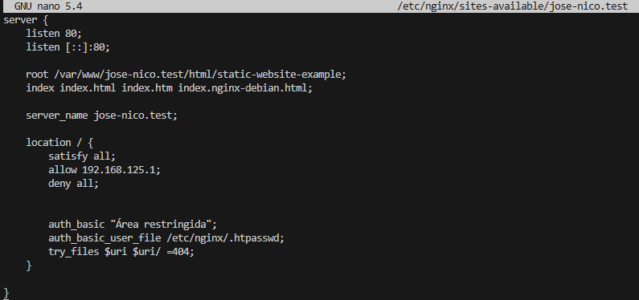

Para que se cargue esta configuracion se tendría que reiniciar el servidor nginx con el comando:

```
sudo systemctl restart nginx
```

Y así se reiniciaria el servidor nginx para que se aplicara la nueva configuracion.

Y ahora al intentar acceder a la pagina web desde la ip 192.168.125.1 nos saldria lo siguiente:

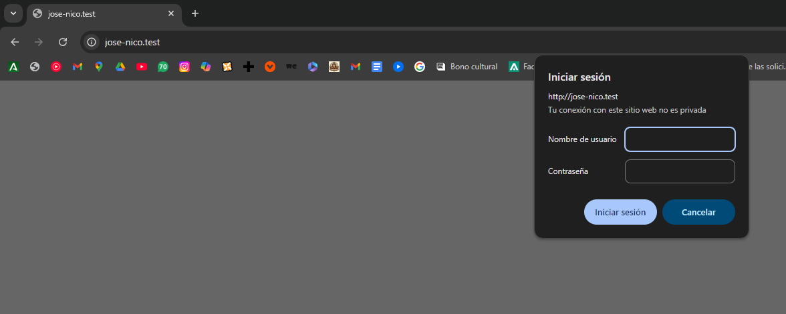

Introducimos el usuario nicolas y la contraseña para este usuario.

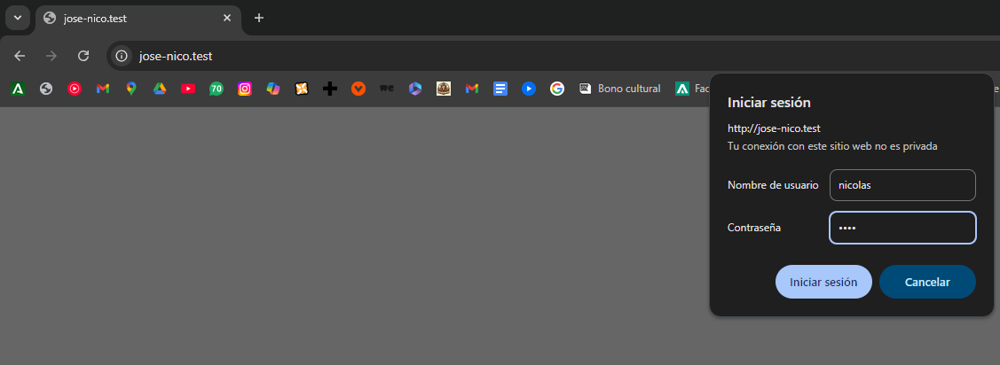

Y efectivamente se mostraria la pagina web.


En el archivo access.log nos saldria el siguiente mensaje:

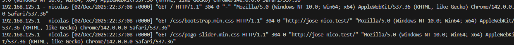

